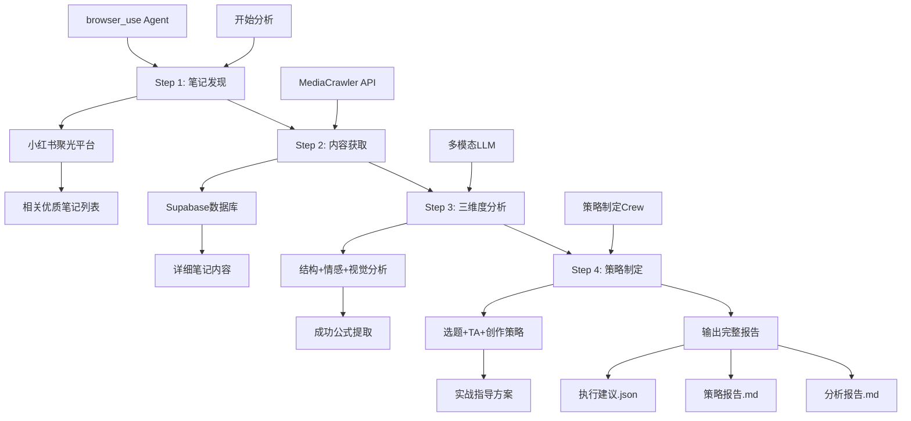
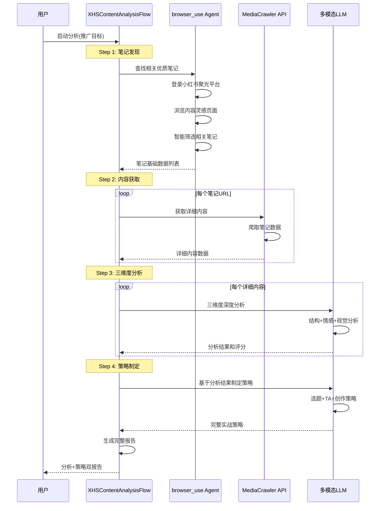

# 小红书笔记分析器 (XHS Note Analyzer)

基于CrewAI Flow + browser_use + MediaCrawler的智能内容分析和策略制定工具，帮助内容创作者通过分析优质笔记快速产出高质量内容并制定实战策略。

## 🌟 功能特性

### 🚀 四步骤智能分析与策略流程

本项目采用CrewAI Flow架构，串行执行四个核心步骤：

1. **🔍 笔记发现** - 使用browser_use agent自动查找相关优质笔记
2. **📥 内容获取** - 通过MediaCrawler API获取笔记详细内容  
3. **🧠 内容分析** - 三维度深度分析（结构、情感、视觉）
4. **🎯 策略制定** - 基于分析结果生成实战策略指导

### 📊 核心能力

- **自动化笔记发现**: 基于业务目标智能筛选相关优质笔记
- **全面内容获取**: 获取文字、图片、视频、作者信息等完整数据
- **三维度深度分析**: 结构分析、情感价值分析、视觉元素分析
- **实战策略制定**: 选题策略、TA策略、内容创作指导
- **智能建议输出**: 提供可直接执行的选题、文案、创意建议

## 📋 项目架构



## 🏗️ 技术架构

### 核心组件

```
xhs_note_analyzer/
├── main.py                          # 主Flow控制器
├── browser_agent/                   # 第一步：笔记发现
│   └── hot_related_note_finder.py   # browser_use自动化代理
├── crews/                           # CrewAI工作组
│   ├── content_analyzer_crew/       # 第三步：三维度分析
│   │   ├── content_analyzer_crew.py
│   │   ├── models.py
│   │   └── config/
│   └── strategy_maker_crew/         # 第四步：策略制定
│       ├── strategy_maker_crew.py
│       ├── models.py
│       └── config/
└── tools/                           # 工具集
    ├── hot_note_finder_tool.py      # 笔记发现工具
    ├── mediacrawler_client.py       # MediaCrawler API客户端
    └── custom_tool.py               # 自定义工具
```

### 数据流



## 🚀 快速开始

### 环境准备

1. **安装依赖**
```bash
pip install crewai browser-use requests langchain-openai pydantic
```

2. **配置环境变量**
```bash
# OpenRouter API (用于LLM调用)
export OPENROUTER_API_KEY="your_openrouter_api_key"

# MediaCrawler API服务器
export MEDIACRAWLER_API_ENDPOINT="http://localhost:8000"
export MEDIACRAWLER_API_KEY="your_api_key"  # 可选

# 小红书聚光平台认证(browser_use需要)
# 认证信息已保存在 xiaohongshu_auth.json
```

3. **启动MediaCrawler服务器**
```bash
# 克隆MediaCrawler API服务器
git clone https://github.com/BradLeon/MediaCrawler-API-Server.git
cd MediaCrawler-API-Server
git checkout Api-server-branch

# 启动服务器
python app/main.py
```

### 运行分析

```python
from xhs_note_analyzer.main import kickoff_content_analysis

# 启动内容分析流程
result = kickoff_content_analysis(
    promotion_target="国企央企求职辅导小程序",
    business_context="专注于国企央企求职培训的教育机构"
)

print("🎉 分析完成！查看 output/ 目录获取详细报告")
```

### 输出结果

分析完成后，将在`output/`目录生成：

**Step3 内容分析结果**：
- `content_analysis_report.json` - 详细分析数据
- `content_analysis_report.md` - Markdown分析报告

**Step4 策略制定结果**：
- `strategy_report.json` - 完整策略数据
- `strategy_report.md` - Markdown策略报告
- `strategy_summary.txt` - 策略执行摘要

**综合结果**：
- `xhs_content_analysis_result.json` - 完整流程数据
- `analysis_summary.txt` - 综合分析摘要

## 📖 详细功能说明

### Step 1: 笔记发现 (browser_use Agent)

使用browser_use框架自动化操作小红书聚光平台：

- 自动登录聚光平台
- 导航到内容灵感页面
- 基于语义相关性智能筛选笔记
- 提取笔记基础数据（标题、URL、互动数据）

**特色功能**：
- 精确元素定位 (CSS选择器 + XPath)
- 智能翻页和批量处理
- 状态管理和错误恢复

### Step 2: 内容获取 (MediaCrawler API)

通过MediaCrawler API服务器获取完整笔记内容：

```python
# API调用示例
client = MediaCrawlerClient()
content = client.crawl_note(note_url, fetch_comments=False)
```

**获取内容包括**：
- 笔记文字内容
- 图片和视频URL
- 作者信息和互动数据
- 标签和发布时间

**数据存储**：
- 内容存储在Supabase数据库
- 支持批量查询和搜索
- 提供缓存机制避免重复爬取

### Step 3: 三维度深度分析 (多模态LLM)

使用ContentAnalyzerCrew进行专业的三维度分析：

```python
# 创建分析器并执行分析
analyzer = create_content_analyzer()
analysis_report = analyzer.analyze_multiple_notes(detailed_notes)
```

**三维度分析详情**：

1. **内容结构分析**：
   - 标题模式识别
   - 开头策略分析
   - 内容框架梳理
   - 结尾设计解读

2. **情感价值分析**：
   - 用户痛点挖掘
   - 价值主张提炼
   - 情感触发点识别
   - 共鸣元素分析

3. **视觉元素分析**：
   - 配图风格特点
   - 色彩搭配规律
   - 排版设计亮点
   - 视觉吸引力评估

### Step 4: 实战策略制定 (StrategyMakerCrew)

基于Step3分析结果，制定三维度实战策略：

```python
# 分析维度
analysis_dimensions = [
    "内容结构分析",    # 标题模式、开头策略、内容框架
    "情感价值分析",    # 痛点挖掘、价值主张、情感触发
    "视觉元素分析"     # 配图风格、色彩搭配、排版特点
]
```

**Step3 输出内容**：
- 三维度评分和分析报告
- 成功公式和共同模式提取
- 高质量案例的深度解读
- Markdown格式的分析报告

**Step4 输出策略**：
- 选题策略（热门话题、标题公式）
- TA策略（用户画像、核心需求）
- 创作指导（文案、配图、视频）
- 实战建议和差异化要点

## 🔧 配置说明

### browser_use配置

```python
# 浏览器配置
browser_session = BrowserSession(
    allowed_domains=['https://*.xiaohongshu.com'],
    storage_state='./xiaohongshu_auth.json',  # 登录状态
    headless=False,  # 可视化调试
)
```

### MediaCrawler API集成

参考官方文档：
- [API接口规范](https://github.com/BradLeon/MediaCrawler-API-Server/blob/Api-server-branch/API%E6%8E%A5%E5%8F%A3%E8%A7%84%E8%8C%83%E6%96%87%E6%A1%A3.md)
- [数据API](https://github.com/BradLeon/MediaCrawler-API-Server/blob/Api-server-branch/app/api/data.py)

### LLM模型配置

```python
# 支持多种LLM模型
llm_configs = {
    "analysis": "anthropic/claude-3.5-sonnet",    # 内容分析
    "planning": "google/gemini-2.5-flash",       # 规划任务
    "creativity": "openai/gpt-4-vision-preview"  # 创意生成
}
```

## 🛠️ 开发指南

### 扩展新的分析维度

1. 在`ContentAnalyzerCrew`中添加新的分析Agent
2. 更新`config/agents.yaml`和`config/tasks.yaml`
3. 在`models.py`中定义新的分析模型
4. 修改分析报告生成逻辑

### 集成新的数据源

1. 在`tools/`目录创建新的客户端
2. 实现`BaseTool`接口
3. 在相应的Crew中注册工具

### 自定义业务逻辑

修改`XHSContentAnalysisFlow`中的方法：
- `_mock_find_notes()` - 自定义笔记筛选逻辑
- `_generate_final_recommendations_from_analysis()` - 基于分析结果生成建议
- `step4_strategy_making()` - 定制策略制定流程
- `_save_analysis_results()` - 自定义结果保存格式

## 📊 性能监控

### 执行日志

流程执行过程中会生成详细日志：
- `output/debug/conversation/` - 完整对话历史
- `output/debug/debug_execution.gif` - 执行过程可视化

### 状态跟踪

```python
# 查看流程状态
flow = XHSContentAnalysisFlow()
status = flow.state

print(f"找到笔记: {len(status.found_notes)}")
print(f"详细内容: {len(status.detailed_notes)}")  
print(f"分析建议: {len(status.content_analysis)}")
```

## 🤝 贡献指南

欢迎提交Issue和Pull Request！

### 开发环境设置

```bash
git clone https://github.com/your-repo/xhs_note_analyzer.git
cd xhs_note_analyzer
pip install -e .
```

### 运行测试

```bash
# 测试MediaCrawler客户端
python src/xhs_note_analyzer/tools/mediacrawler_client.py

# 测试三维度分析功能
python src/xhs_note_analyzer/crews/content_analyzer_crew/content_analyzer_crew.py

# 测试策略制定功能
python src/xhs_note_analyzer/crews/strategy_maker_crew/strategy_maker_crew.py

# 运行完整流程
python src/xhs_note_analyzer/main.py
```

## 📄 许可证

MIT License

## 🔗 相关链接

- [CrewAI官方文档](https://docs.crewai.com/)
- [browser_use项目](https://github.com/browser-use/browser-use)
- [MediaCrawler API服务器](https://github.com/BradLeon/MediaCrawler-API-Server)
- [OpenRouter API](https://openrouter.ai/)

---

**💡 提示**: 这是一个演示项目，展示了如何将多个AI工具和服务整合到一个完整的工作流程中。可以根据具体需求调整和扩展功能。
